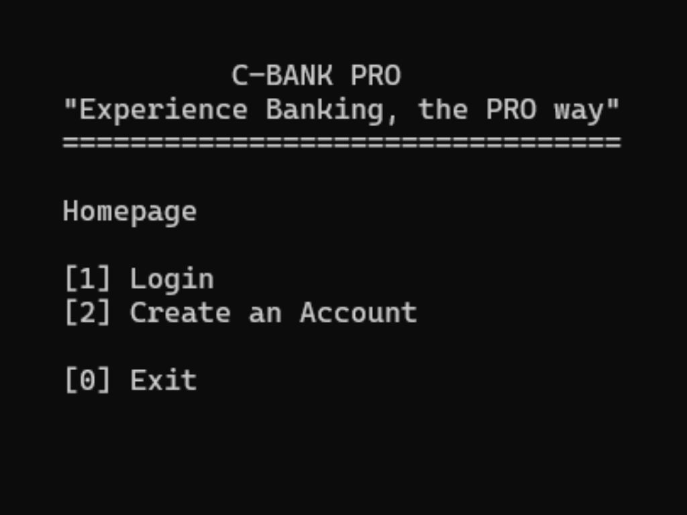
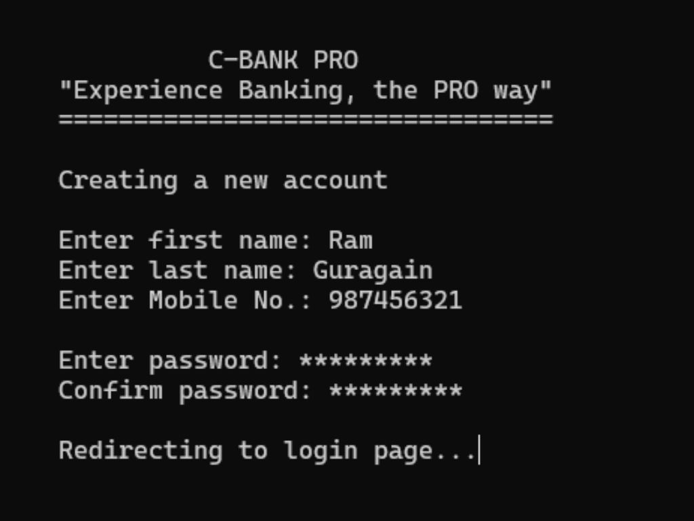
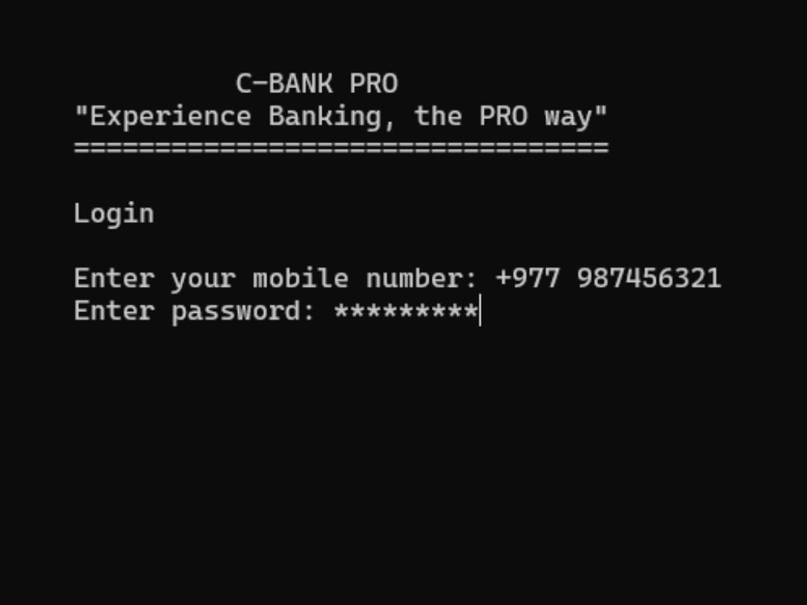
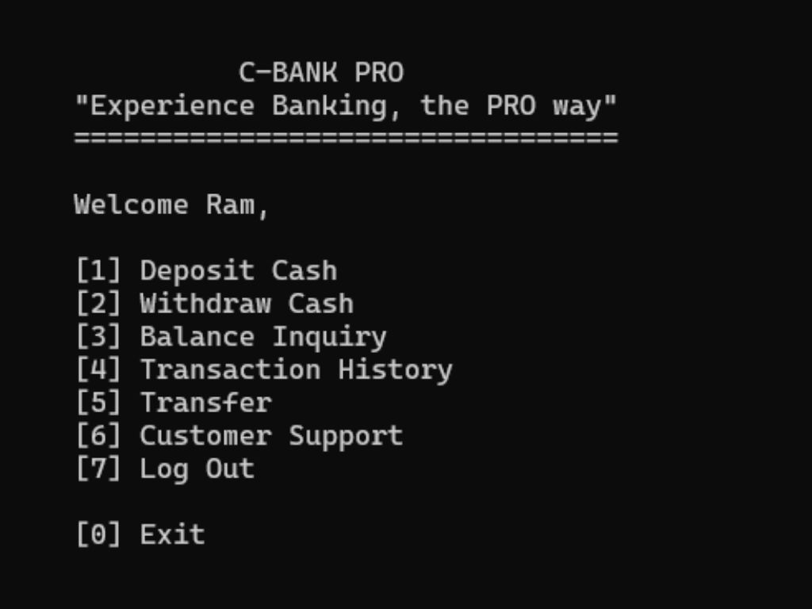
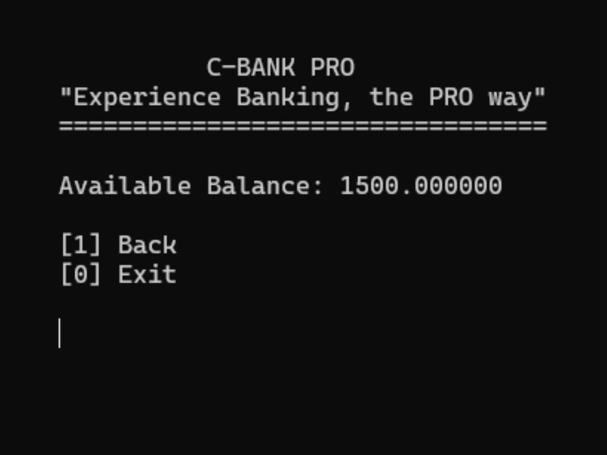
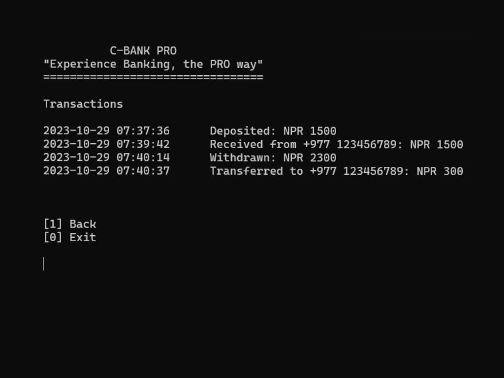

# About C-Bank Pro
C-Bank Pro is a simple console-based banking application implemented in C. It allows users to create accounts, perform various banking operations, and check their balances.

## Prerequisites
Before you begin, ensure you have met the following requirements:
- **C Compiler**: You need a C compiler to compile and run the C source code. For example, you can use `GCC` on Unix-based systems or `MinGW` on Windows.

## Getting Started
1. **Clone the Repository:** Clone this GitHub repository to your local system:

    ```shell
    git clone https://github.com/prabhavpokharel/C-Bank-Pro.git
    ```
2. **Compile the Code:** Navigate to the project directory and compile the C source code based on your platform.
   - On Unix-based systems (using GCC):

     ```shell
     gcc main.c -o c-bank-pro
     ```
   - On Windows (using MinGW):

     ```shell
     gcc main.c -o c-bank-pro
     ```

   This will create an executable file named `c-bank-pro`.

3. **Run the Program:** Start C-BANK PRO by executing the compiled program.
   - On Unix-based systems:

     ```shell
     ./c-bank-pro
     ```
   - On Windows:

     ```shell
     c-bank-pro.exe
     ```

   The program will launch, and you'll see the C-BANK PRO interface.

# Application Workflow
1. **Create an account:** You can create a new user account by selecting "Create an Account" and following the prompts to enter your information.
2. **Log in:** If you already have an account, select "Login," enter your phone number, and provide your password to log in.
3. **Perform banking operations:** Once logged in, you can deposit cash, withdraw cash, check your balance, view transaction history, transfer money to other users, and access customer support.
4. **Exit:** When you are done using the application, select "Exit" to log out and exit the application.

# Contributors
- [Prabhav Pokharel](https://github.com/prabhavpokharel)
- [Sahaj Pokharel](https://github.com/sahajpokharel) 

# Project Preview
#### Screenshots







#### Demonstration
[Watch the Demo Video](https://youtu.be/xSsRk-wUCtM)

# Disclaimer
This application is a simple example and is not suitable for real-world banking applications. It does not provide security measures or data validation, and it's designed for educational purposes only.
